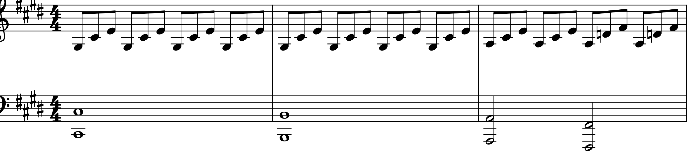

# R.Schumann Fantasie in C Major Op.17
## Composed: 1836
## Structure: 3 movements
## Duration: Approx. 30-35 minutes

- [Timeline](#timeline)
- [Piano Sonata No. 14 in C# minor, Op. 27, No. 2 ("Moonlight Sonata")](#piano-sonata-no-14-in-c#-minor-op-27-no-2-moonlight-sonata)
- [Influences](#influences)
- [Significance](#significance)
- [Performance and Reception](#performance-and-reception)
- [Listening Guide](#listening-guide)

---

## Timeline

**Robert Schumann** (1810-1856) is one of the most significant composers in the history of Western classical music. He is known for his piano works, orchestral compositions, and chamber music, often blending lyrical expression with innovative harmonic structures. Also, Schumann often used descriptive titles related to literary ideas and thanks to the advanced piano techniques, sought effective sound and tone by employing a wide range of pedaling. Moreover, as Schumann was a pianist, he had a deep understanding of the piano's capabilities and expanded the role of the left hand, thereby extending its range.

| Year | Event | Description                                                                                                 | Youtube |
| ---- | ----- | ----------------------------------------------------------------------------------------------------------- | ------- |
| 1810 | Birth | Born on June 8 in Zwickau, Germany.
| 1830 | Full-time | Decides to pursue music full-time, focusing on piano and composition.
| 1834 | Found | Co-founds the music journal Neue Zeitschrift für Musik.
| 1839 | Marriage | Marries Clara Wieck, a renowned pianist, despite opposition from her father.
| 1840 | Composes lieder | Composes over 100 lieder (songs) in a highly productive year.
| 1841 | Composes symphony | Composes his first symphony, Spring Symphony.
| 1843 | Director | Becomes the director of the Leipzig Conservatory.
| 1854 | Mental breakdown | Suffers a mental breakdown and is institutionalized in Endenich.
| 1856 | Death | Dies on July 29 in Endenich, Germany.

---
## Fantasie in C Major Op.17

This work is *Beethoven's Piano Sonata No. 14 in C♯ minor, Op. 27, No. 2*, commonly known as the **"Moonlight Sonata**."

In 1801, the year "Moonlight Sonata" was composed, Beethoven's hearing problems worsened, and his relationship with Giulietta Guicciardi faced difficulties. These personal struggles profoundly influenced his music, and "Moonlight Sonata" is one of the works where his emotions and turmoil are vividly expressed, earning it much admiration.

The title "Moonlight" was not given by Beethoven himself. It originated five years after his death when *Ludwig Rellstab* described the first movement as resembling **"a boat on the Lake Lucerne illuminated by moonlight."**

## Movement Breakdown

**1st Movement – Adagio sostenuto**

The first movement opens in C♯ minor and creates a deeply introspective and contemplative atmosphere. The movement deviates from traditional sonata form by using a single theme that is continuously varied, rather than presenting multiple contrasting themes. There are no dramatic tempo changes or modulations, which sets this movement apart from many of Beethoven's other works.

The instruction *"sostenuto"* (sustained) emphasizes that the notes should be played with deep expressiveness, allowing them to resonate fully. Beethoven further directs that the piece should be played *"Si deve suonare tutto questo pezzo delicatissimamente e senza sordini"* (very delicately and without the damper), which indicates a need for a soft, clear, and resonant sound. The music's simplicity allows the performer to focus entirely on expressing the deep emotions embedded in the piece, making this movement feel intimate, almost like an inner monologue.

**2nd Movement – Allegretto**

The second movement contrasts sharply with the first. It is lighter, more playful, and offers a brief respite from the intensity of the opening. This movement provides a sense of balance and acts as a kind of emotional relief before the stormy finale of the third movement. The clarity and charm of the Allegretto offer a moment of brightness, though it still retains an undercurrent of the piece's overall melancholy.

**3rd Movement – Presto agitato**

The third movement brings the sonata to a dramatic and intense conclusion. Marked Presto agitato, this movement is fast, forceful, and filled with energy. It contrasts with the meditative calm of the first movement and the lightness of the second, creating a sense of resolution and finality. The turbulent nature of the movement displays Beethoven's technical brilliance and emotional depth, offering a compelling and vigorous conclusion to the sonata.

**"Moonlight Sonata"** stands as a testament to Beethoven's ability to channel personal suffering into transcendent beauty. Through its simple yet powerful structure, it expresses an emotional range that has resonated with listeners for centuries. Despite the personal struggles Beethoven faced during its composition—most notably his increasing deafness—this sonata remains one of his most beloved and enduring works, demonstrating the enduring power of music to communicate universal human emotions.

This program note offers listeners a deeper understanding of the musical structure, emotional depth, and historical context of Beethoven's Moonlight Sonata, enhancing the listening experience and helping them connect with the piece on a more profound level.

## Influences

**1. Emotional Expression Evolution**
The "Moonlight Sonata" features emotional depth and introspective expression that were unprecedented in piano sonatas of its time. The first movement, with its gentle and lyrical atmosphere, conveys a sense of melancholy and inner turmoil, which may reflect Beethoven’s own struggles with his hearing loss and personal challenges. This sonata represents a new level of personal, inward emotional expression, opening up a new dimension in how emotions were portrayed in music.

**2. Challenge to Traditional Sonata Form**
This sonata deviates from the traditional three-movement sonata form, offering a more non-traditional structure. The first movement is extremely slow and lyrical, which presents a new approach to sonata form. This challenge to the conventional structure paved the way for later composers to experiment with and break free from traditional forms, particularly those in the Romantic period.

## Significance

## Performance and Reception

## Listening Guide
